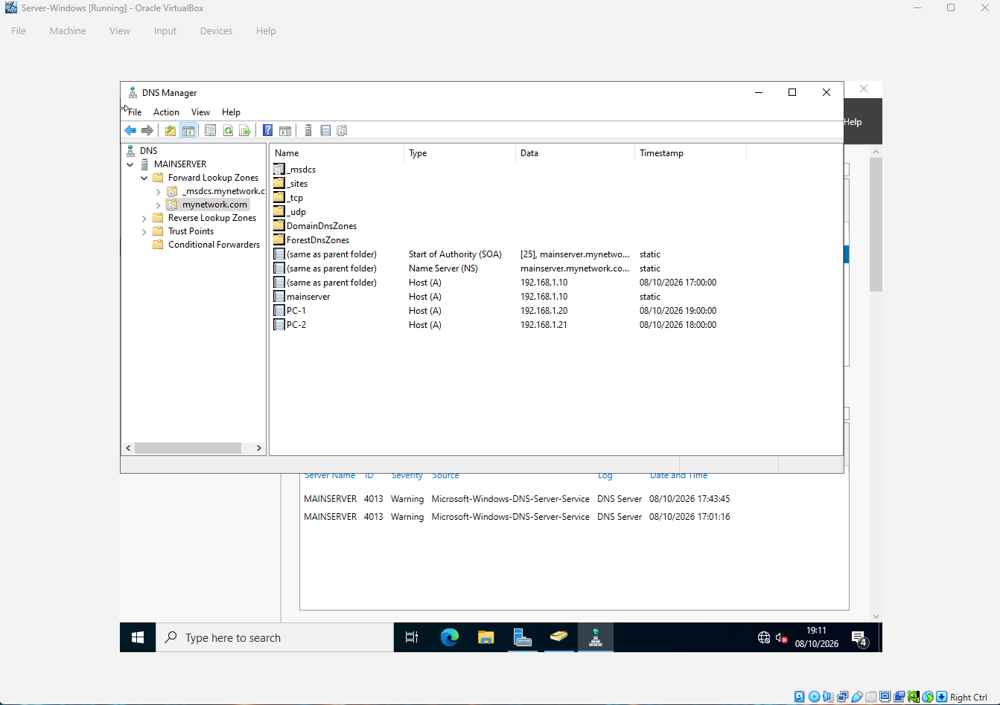
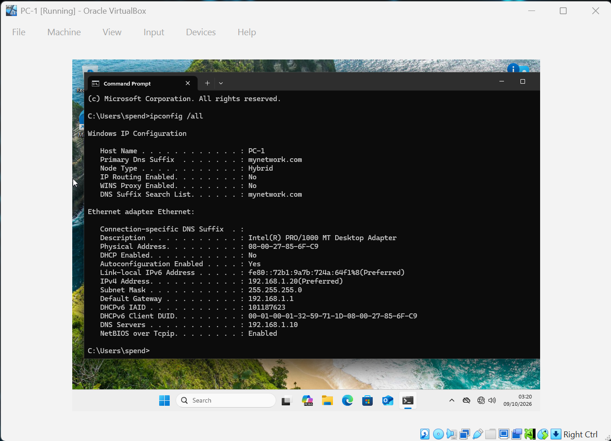
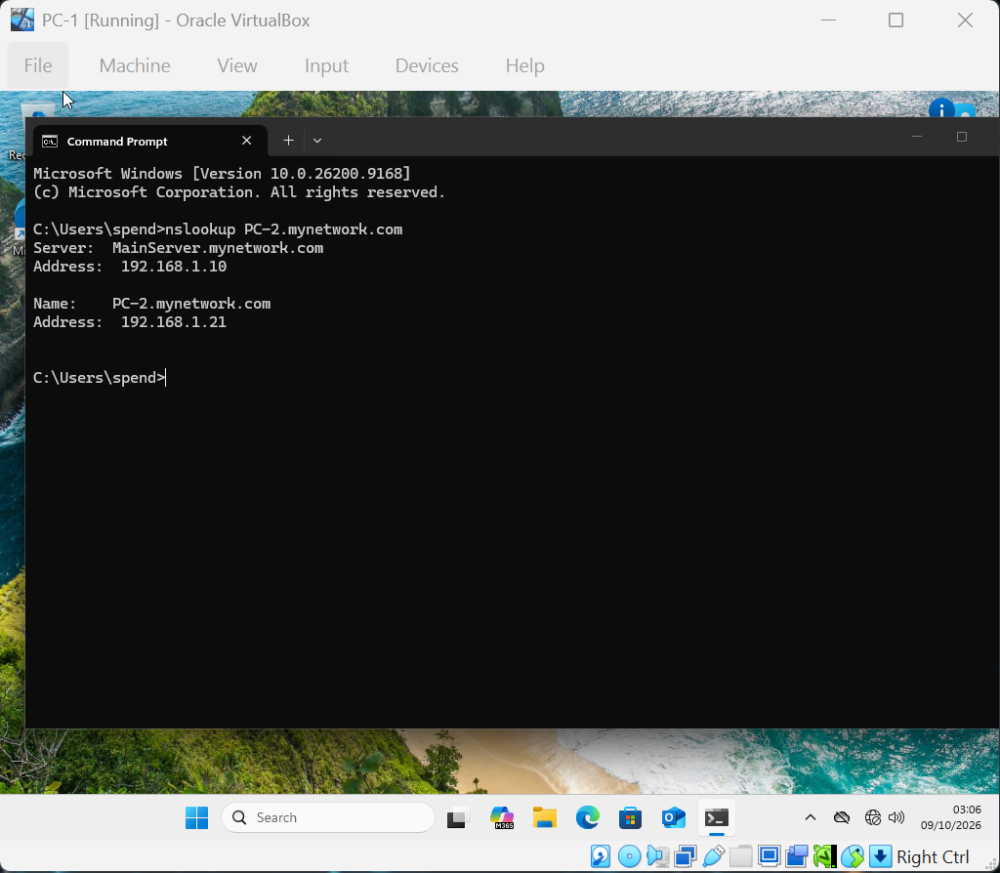
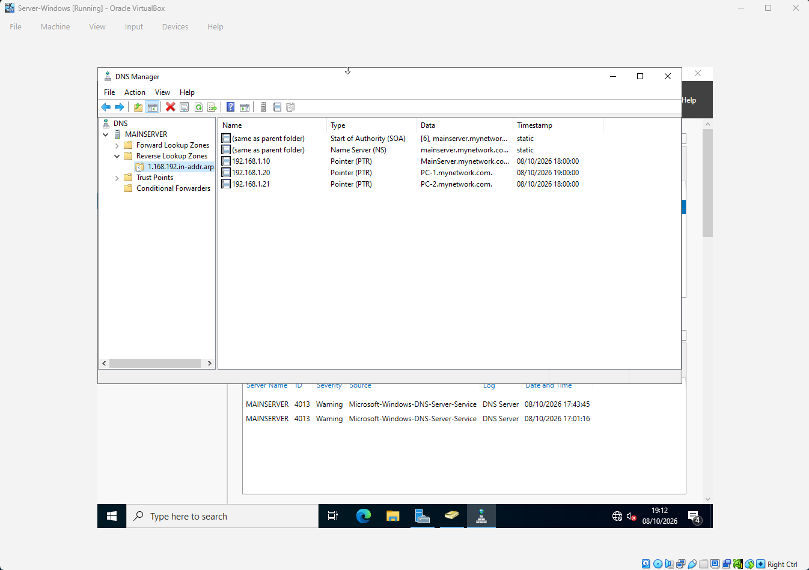

# DNS Configuration

## Overview

This project demonstrates the configuration and testing of **Domain Name System (DNS)** within my Windows Server Active Directory lab.

DNS is a critical component of an Active Directory environment because it allows devices and services to locate each other using hostnames and domain names instead of relying solely on IP addresses.

The objective of this lab was to configure DNS, create and verify forward and reverse DNS records, and confirm that a Windows client could successfully resolve hostnames through the configured DNS server.

---

## Lab Environment

| Component | Details |
|---|---|
| DNS Server | Windows Server / Domain Controller |
| Client | PC-1 | PC-2 |
| Network | `mynetwork.com` |
| DNS Server | Domain Controller |

---

## DNS Configuration

The DNS server was configured as part of the Windows Server Active Directory environment.

The configuration includes:

- Forward Lookup Zone
- Reverse Lookup Zone
- Host (A) records
- Reverse DNS (PTR) records
- Client DNS configuration
- DNS name resolution testing

The client computer was configured to use the internal DNS server so that it could resolve hosts within the `mynetwork.com` domain.

---

## 1. Forward DNS Records

The Forward Lookup Zone maps hostnames to IP addresses.

For example:

```text
pc-2.mynetwork.com → 192.168.1.21
```

This allows a device to find the IP address associated with a hostname.

The following screenshot shows the configured **Forward DNS records** within DNS Manager.



**What this demonstrates:**

- The `mynetwork.com` Forward Lookup Zone exists.
- Host records have been created.
- `pc-2` has a corresponding DNS record.
- The DNS server can associate hostnames with IP addresses.

---

## 2. Client DNS Configuration

The client configuration was verified using:

```powershell
ipconfig /all
```



The output shows the network configuration of PC-2, including its configured DNS server.

This is important because the client must use the correct DNS server to resolve internal domain names.

**What this demonstrates:**

- Client IP configuration
- Subnet configuration
- Default gateway
- Configured DNS server
- Network connectivity information

---

## 3. DNS Name Resolution Test

DNS resolution was tested using:

```powershell
nslookup pc-2.mynetwork.com
```



The successful response demonstrates that the DNS server can resolve:

```text
pc-2.mynetwork.com
```

to the corresponding IP address.

This provides practical verification that the Forward Lookup Zone is functioning correctly.

### Expected Resolution

```text
Hostname:
pc-2.mynetwork.com

        ↓ DNS Query

DNS Server

        ↓

IP Address:
[Client IP Address]
```

---

## 4. Reverse DNS Records

Reverse DNS performs the opposite operation of a normal DNS lookup.

Instead of:

```text
Hostname → IP Address
```

reverse DNS performs:

```text
IP Address → Hostname
```

This is implemented using **PTR (Pointer) records** within a Reverse Lookup Zone.

The following screenshot shows the configured **Reverse DNS records**.



**What this demonstrates:**

- A Reverse Lookup Zone has been configured.
- PTR records are present.
- IP addresses can be associated with hostnames.
- Forward and reverse DNS can be used together to verify name resolution.

---

## DNS Testing Summary

The DNS configuration was verified through several stages:

```text
┌─────────────────────────────┐
│ DNS Server Configuration    │
└──────────────┬──────────────┘
               │
               ▼
┌─────────────────────────────┐
│ Forward Lookup Records      │
│ Hostname → IP Address       │
└──────────────┬──────────────┘
               │
               ▼
┌─────────────────────────────┐
│ Client DNS Configuration    │
│ ipconfig /all               │
└──────────────┬──────────────┘
               │
               ▼
┌─────────────────────────────┐
│ DNS Resolution Test         │
│ nslookup pc-2.mynetwork.com │
└──────────────┬──────────────┘
               │
               ▼
┌─────────────────────────────┐
│ Reverse DNS                 │
│ IP Address → Hostname       │
└─────────────────────────────┘
```

## Skills Demonstrated

Through this lab I practiced:

- Windows Server DNS configuration
- Forward DNS
- Reverse DNS
- A records
- PTR records
- DNS client configuration
- `ipconfig /all`
- `nslookup`
- DNS troubleshooting
- Hostname-to-IP resolution
- IP-to-hostname resolution
- Basic network administration

## Conclusion

This lab demonstrates the configuration and verification of DNS within a Windows Server environment.

Rather than only configuring DNS, I verified its functionality from both directions: resolving a hostname to an IP address through a forward lookup and resolving an IP address back to a hostname through reverse DNS.

The testing provided practical evidence that the DNS configuration was functioning correctly and that the client was communicating with the intended DNS server.