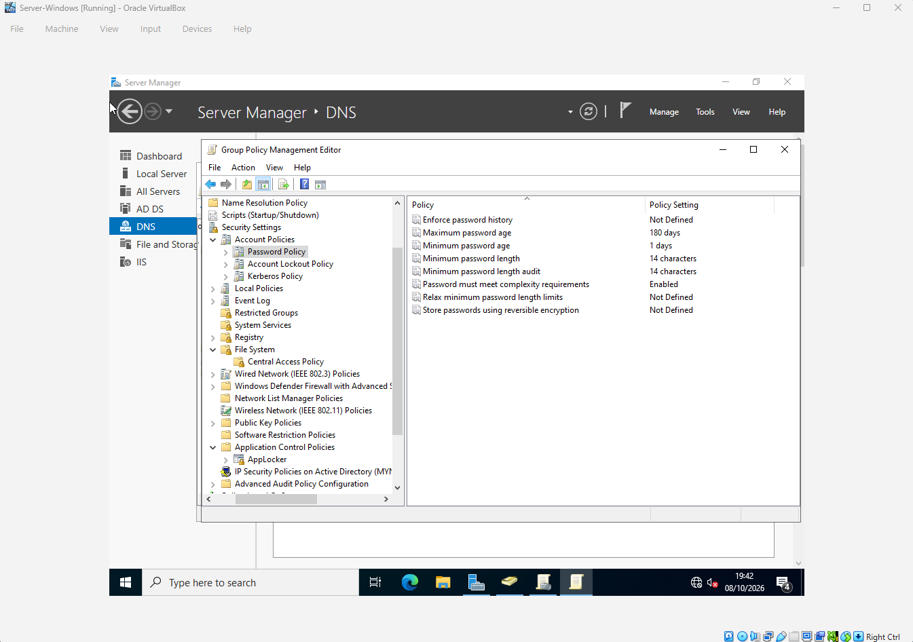
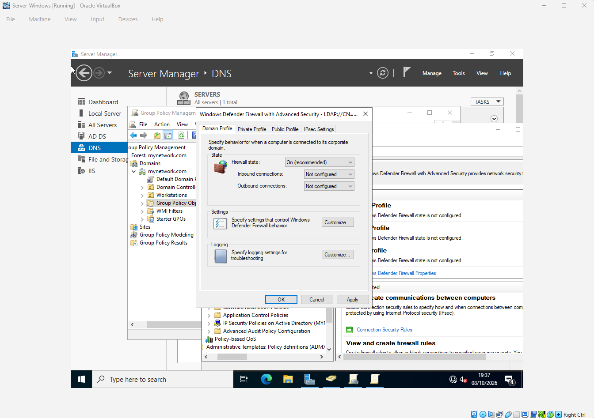
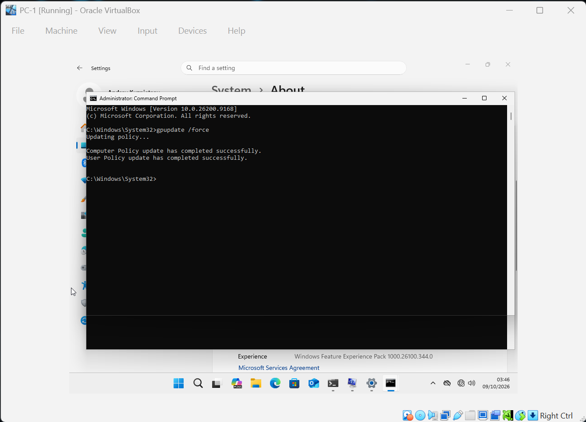
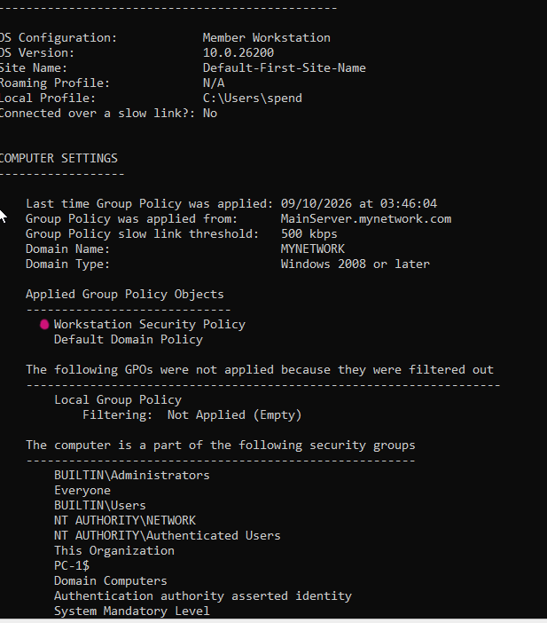

# Group Policy Object (GPO) Configuration

## Overview

This project demonstrates the creation, configuration, deployment, and verification of a **Group Policy Object (GPO)** within a Windows Server Active Directory environment.

The purpose of this lab was to understand how Group Policy can be used to centrally manage Windows computers and users within a domain.

Instead of configuring each workstation individually, a GPO allows administrators to define settings centrally and apply them to computers or users within a specific Organizational Unit (OU).

---

## Lab Environment

| Component | Configuration |
|---|---|
| Domain Controller | Windows Server |
| Domain | `mynetwork.com` |
| Client | `PC-2` , `PC-1` |
| Directory Services | Active Directory Domain Services |
| Policy Management | Group Policy Management |
| Target OU | `Workstations` |

---

## Objectives

The objectives of this lab were to:

- Create an Organizational Unit
- Create a Group Policy Object
- Configure policy settings
- Link the GPO to an Organizational Unit
- Apply the policy to a domain-joined computer
- Force a Group Policy update
- Verify that the policy was successfully applied
- Understand the relationship between Active Directory, OUs, and GPOs

## Project Execution

-- Oranizational Unit "Workstations"   
Created Oranizational Unit "Workstations" and moved PC-1 and PC-2 Computers to there

-- Create a Group Policy Object
Using Group Policy Management created Workstation Security Policy in the directory Group Policy Objects

-- Configure policy settings:

      Password Security:
          Maximum password age: 180 days
          Minimum password age: 1 days
          Minimum password length: 14 characters
          Password must meet complexity requirements
   

      Network Security:
         Forced logoff when out of working hours
         Windows Firewall Enabled
  

-- Link the GPO to an Organizational Unit
Linked Workstation Security Policy to the "Workstations" OU

-- Force a Group Policy update
Run command "gpupdate /force" on the client "PC-1"/"PC-2"  to update group policy
   

-- Verify that the policy was successfully applied
Run command "gpresult /r" on the client "PC-1"/"PC-2"  to verify updated policies applied
   

# Skills Demonstrated

This project demonstrates practical experience with:

- Active Directory
- Organizational Units
- Group Policy Management
- Group Policy Objects
- GPO configuration
- GPO linking
- Windows Server administration
- Windows client administration
- Centralized configuration management
- `gpupdate`
- `gpresult`
- Group Policy troubleshooting
- Basic Active Directory administration

---
